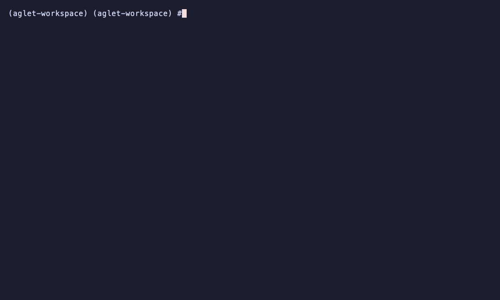
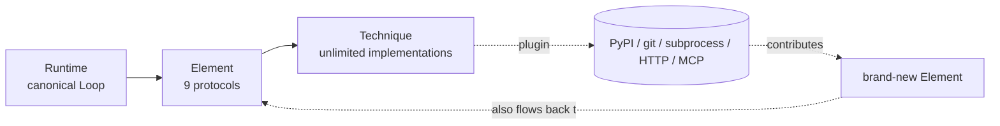

<div align="center">

# Aglet

### Every Agent capability is a swappable plugin.

[](https://pypi.org/project/aglet/)
[](LICENSE)
[](pyproject.toml)
[](tests/)

A pluggable Agent runtime where **every Element** (perception, memory, planner,
tool, executor, safety, output, observability, extensibility) **and every
Technique within an Element** ships as its own PyPI package and is selected
by a single YAML file.

No fork. No fork-and-patch. No "how do I swap out the memory module". Just `pip`
and YAML.



</div>

---

## 5-minute tutorial

### 1. Install the minimum runnable agent

```bash
pip install --pre aglet aglet-cli \
    aglet-builtin-perception-passthrough \
    aglet-builtin-memory-sliding-window \
    aglet-builtin-planner-echo \
    aglet-builtin-output-streaming-text \
    aglet-builtin-safety-budget \
    aglet-builtin-obs-console
```

### 2. Scaffold and run

```bash
aglet init my-agent && cd my-agent
aglet run agent.yaml --input "hello, Aglet!"
```

You get:

```text
[14:07:55] run.started              payload={"run_id": "…"}
[14:07:55] perception.done          element=perception
[14:07:55] memory.recalled          element=memory
[14:07:55] planner.thought          element=planner technique=echo
[14:07:55] planner.final            element=planner technique=echo
[14:07:55] output.chunk             element=output payload={"text": "Echo: he"}
[14:07:55] output.chunk             element=output payload={"text": "llo, Agl"}
[14:07:55] output.chunk             element=output payload={"text": "et!"}
[14:07:55] run.completed            payload={"steps": 1}

Echo: hello, Aglet!
```

And `.aglet/runs/<run_id>.jsonl` has the full event-sourced trace, ready for
replay via `aglet resume agent.yaml <run_id>`.

### 3. Swap `planner.echo` for a real LLM

Upgrade the agent to a function-calling ReAct loop talking to any
OpenAI-compatible endpoint. **No code change** — only YAML:

```bash
pip install --pre aglet-builtin-planner-react aglet-builtin-model-openai \
                  aglet-builtin-executor-sequential \
                  aglet-builtin-tool-local-python \
                  aglet-builtin-memory-rag
```

Edit `agent.yaml`:

```yaml
providers:
  - name: openai
    type: openai_compat
    config:
      api_key: ${OPENAI_API_KEY}
      base_url: ${OPENAI_BASE_URL:-https://api.openai.com/v1}

models:
  default:  openai/gpt-4o-mini
  embedder: openai/text-embedding-3-small

elements:
  perception:
    techniques: [{ name: passthrough }]
  memory:
    techniques:
      - { name: sliding_window, config: { max_messages: 20 } }
      - { name: rag, config: { uri: ./.aglet/vec, top_k: 4 } }
    routing: parallel_merge          # run both and merge their hits
  planner:
    techniques:
      - { name: react, config: { model: default } }
  tool:
    techniques:
      - name: local_python
        config:
          tools:
            - name: now_iso
              import: datetime:datetime.utcnow
  executor: { techniques: [{ name: sequential }] }
  safety:   { techniques: [{ name: budget_only }] }
  output:   { techniques: [{ name: streaming_text }] }
  observability:
    techniques: [{ name: console }, { name: jsonl }]
```

```bash
export OPENAI_API_KEY=sk-...
aglet run agent.yaml --input "what time is it?"
```

### 4. Swap planner strategies in one line

Want self-critique on every answer? Change one line:

```yaml
planner:
  techniques:
    - name: reflexion                # was: react
      config: { inner: react, max_reflections: 1 }
```

Want parallel beam search on 3 candidate answers?

```yaml
planner:
  techniques:
    - name: tot
      config: { branches: 3 }
```

Want multi-agent orchestration? Just add another agent as a Tool:

```yaml
tool:
  techniques:
    - name: subagent
      config:
        agents:
          - name: research
            path: ./research-agent.yaml
            input_field: question
```

### 5. Write your own Element. Yes, really.

Suppose you want a brand-new Element `compliance` that doesn't exist anywhere in
the framework. Create a standalone package:

```python
# my_pkg/__init__.py
from typing import Protocol, runtime_checkable
from aglet.context import AgentContext, ContextPatch

@runtime_checkable
class ComplianceProtocol(Protocol):
    element_kind: str
    async def scan(self, text: str) -> list[dict]: ...

class CnPiiScanner:
    name = "cn_pii_scanner"
    element = "compliance"
    capabilities = frozenset({"scan"})
    async def scan(self, text): ...
```

```toml
# pyproject.toml
[project.entry-points."aglet.elements"]
compliance = "my_pkg:ComplianceProtocol"

[project.entry-points."aglet.techniques"]
"compliance.cn_pii_scanner" = "my_pkg:CnPiiScanner"
```

```bash
pip install -e .
aglet techniques --element compliance
# → compliance / cn_pii_scanner
```

Now anyone's `agent.yaml` can say:

```yaml
elements:
  compliance:
    techniques: [{ name: cn_pii_scanner }]
```

and it just works. Nothing was changed in `aglet`. This is [validated end-to-end
by `tests/integration/test_third_party_element.py`](tests/integration/test_third_party_element.py).

---

## Why Aglet?

Most Agent frameworks hardcode memory / planner / tool semantics into the
runtime. Swapping one requires a fork. That's fine for a demo, fatal for
long-lived production agents that need to evolve.

Aglet inverts the relationship:

| Traditional framework | Aglet |
| --- | --- |
| Monolithic runtime | Protocol layer + 4 interchangeable plugin runtimes |
| "Tools" are pluggable; nothing else is | **All 9 Elements** and their techniques are pluggable |
| Forks accumulate | Each capability = one PyPI distribution |
| No way to add a 10th concern | Third parties publish wholly new Element kinds |

## Architecture



Every arrow is a well-defined interface that third parties extend without
touching core. The full design document is at
[`docs/architecture.md`](docs/architecture.md) with UML class / sequence /
state / component / deployment diagrams and 10 ADRs.

## The 26 packages currently shipped

All live on PyPI as `0.1.0a2` (core) / `0.1.0a1` (builtins).

| Tier | Packages |
| --- | --- |
| Core | `aglet`, `aglet-cli`, `aglet-server`, `aglet-eval` |
| Perception | `aglet-builtin-perception-passthrough` |
| Memory | `aglet-builtin-memory-{sliding-window,rag,summary}` |
| Planner | `aglet-builtin-planner-{echo,react,reflexion,tot,workflow}` |
| Tool | `aglet-builtin-tool-{local-python,http-openapi,mcp,subagent}` |
| Executor | `aglet-builtin-executor-sequential` |
| Safety | `aglet-builtin-safety-{budget,constitutional}` |
| Output | `aglet-builtin-output-streaming-text` |
| Observability | `aglet-builtin-obs-{console,jsonl,otel,langfuse}` |
| Extensibility | `aglet-builtin-extensibility-hooks` |
| Models | `aglet-builtin-model-{openai,litellm,mock}` |

## Features

- **9 first-class Element protocols** plus the ModelProvider plugin point.
- **Immutable `AgentContext` + `ContextPatch` event-sourcing** — free replay,
  free checkpoint/resume, parallel-safe.
- **4 plugin runtimes**: in-process · subprocess JSON-RPC · HTTP · MCP.
- **3 routing strategies** to coordinate multiple Techniques inside one
  Element: `all` / `first_match` / `parallel_merge`.
- **Hook system** with glob patterns like `after.tool.invoke`, `*.*.*`.
- **`Runtime.resume(run_id)`** recovers crashed runs from the JSONL store.
- **HTTP + SSE server** (`aglet-serve agent.yaml`) with REST endpoints.
- **Declarative eval harness** (`aglet-eval suite.yaml`) outputs pass-rate /
  p95 latency / cost, with JUnit XML for CI.
- **CLI**: `init` · `run` · `chat` · `resume` · `runs` · `elements` ·
  `techniques` · `doctor` · `plugin install|list|remove`.
- **Real LLM validated**: end-to-end test against OpenAI `gpt-4o-mini` using
  the `aglet-eval` harness — ~5s per simple turn.

## Roadmap

- **M1 Skeleton** ✅ — 9 Element protocols + default Loop + echo agent.
- **M2 Ecosystem** ✅ — ReAct, MCP, RAG, OTel/LangFuse, HTTP+SSE server.
- **M3 Full pluggability** ✅ — Hooks, subprocess/HTTP runtimes, plugin CLI.
- **M4 Production** ✅ — Checkpoint/Resume, Reflexion, Tree-of-Thoughts,
  multi-agent, declarative eval harness.
- **M5 Marketplace & advanced Techniques** ✅ — static marketplace index,
  `aglet marketplace` CLI, `planner.workflow` DAG, `memory.summary`,
  `safety.constitutional`.
- **M6 (planned)** — KG / episodic memory, DSPy-style prompt optimiser,
  Web UI (separate repo), 1.0 protocol freeze.

See [CHANGELOG.md](CHANGELOG.md) for release history.

## Contributing

We welcome:

- **New Techniques** for existing Elements (send them straight to PyPI; no PR
  needed to list them — they're auto-discovered via entry points).
- **Wholly new Elements** that the framework doesn't cover yet.
- **Conformance-test passes** — every PR to an existing builtin must pass the
  framework's conformance suite (`pytest tests/conformance/`).
- **Docs and examples**.

Development setup:

```bash
git clone https://github.com/zyssyz123/agentkit
cd agentkit
uv sync            # one-command install of the entire monorepo
uv run pytest      # 143 tests, ~1s
uv run aglet run examples/echo-agent/agent.yaml --input "hello"
```

## License

Apache-2.0 — commercial use encouraged.

## Citing

If you use Aglet in research or production we'd love a star and a note in your
build. There's no formal citation yet — we're still pre-1.0.

---

<div align="center">
<sub>Built by the Aglet contributors. Named after the aglet — the small cap at
the end of a shoelace. Tiny piece, makes everything fit.</sub>
</div>
