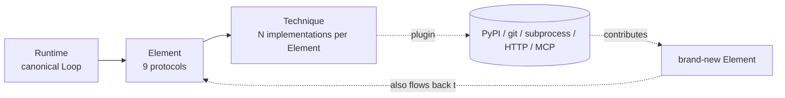

# Aglet: every Agent capability is a swappable plugin

*Why we built a framework where the memory module, the planner, and even
the Element **kinds** themselves are distributed as separate PyPI packages —
and what 143 tests + 26 published distributions taught us.*

---

## The problem

Every LLM Agent framework I've used in the last 18 months hardcodes three
things into the runtime:

1. **What an Agent is made of.** Always the same five-ish parts: planner,
   tool registry, memory, executor, logger.
2. **How those parts talk to each other.** The planner calls tools directly,
   memory is wired into the planner's prompt, observability is a decorator.
3. **What "a Tool" means.** Tools are the only thing the framework makes
   easy to add. Everything else needs a fork.

This is fine for a demo. It is **fatal** for a long-lived production agent
that needs to evolve:

- You want to swap TokenBufferMemory for a Reflexion-style episodic memory?
  Fork.
- You need an on-prem OpenAI-compatible endpoint instead of the framework's
  default client? Fork.
- Your compliance team needs a PII scanner that runs **before every tool
  call** across every agent? Fork, or a 200-line `@decorator` that nobody
  remembers to apply.

Meanwhile the research community keeps publishing drop-in improvements
(Reflexion, Tree-of-Thoughts, MemGPT, LATS, …) that take weeks to land in
any production stack.

## The thesis

The cleanest fix is to invert the pluggability:

> **Every Agent capability — including the *kinds* of capabilities the
> framework knows about — is a swappable plugin, selected by one YAML file.**

Concretely this means two orthogonal axes of extensibility:

| Axis | Traditional frameworks | Aglet |
| --- | --- | --- |
| **Technique layer** (implementations) | Tool-only | 9 Element kinds, all pluggable, all distributed as their own PyPI packages |
| **Element layer** (capability kinds) | Fixed by the runtime | Third parties publish *new* Element kinds (e.g. `compliance`, `emotion`, `workflow`) via a standard entry-point |

If both axes are pluggable, a research group can publish ToT next month and
every production agent that wants it adds one line to its YAML:

```yaml
planner:
  techniques: [{ name: tot, config: { branches: 3 } }]
```

A compliance team can publish `compliance-cn-pii-scanner` and every agent
adds:

```yaml
elements:
  compliance:
    techniques: [{ name: cn_pii_scanner }]
```

No fork. No recompilation. No `@decorator` hygiene.

## The design

Three layers, each a thin protocol:



* **Runtime** — the canonical Agent Loop (perception → memory → plan →
  execute → …). Replaceable for advanced users.
* **Element** — one of 9 first-class protocols (perception, memory,
  planner, tool, executor, safety, output, observability, extensibility),
  each with a tiny interface. Third parties can publish a 10th, 11th, …
  kind by declaring a new `element_kind`.
* **Technique** — a concrete implementation of an Element's protocol
  (e.g. `memory.sliding_window`, `planner.react`, `tool.mcp`). Distributed
  as a standalone PyPI package; Aglet discovers it via Python entry points.

To actually make this decouple work, Aglet centres the runtime on two
invariants that most frameworks skip:

### 1. Immutable `AgentContext` + `ContextPatch` event sourcing

Every Element call returns a `ContextPatch` (a small dict of field
changes). The Runtime applies patches in order and appends them to a
per-run JSONL file. This buys you:

* **Replay** — rebuild the context at any step.
* **Checkpoint / resume** — `Runtime.resume(run_id)` replays the patch
  sequence, sees the terminal event, and continues.
* **Parallel-safe execution** — two Techniques can propose patches from
  the same snapshot; the Runtime merges them.

### 2. Four plugin runtimes behind one interface

Techniques don't have to live in-process:

| Runtime | When | How |
| --- | --- | --- |
| `InProcessRuntime` | Trust boundary is the same process | Python `importlib` via entry points |
| `SubprocessPluginRuntime` | You want isolation, or your plugin is in another language | JSON-RPC 2.0 over stdio |
| `HttpPluginRuntime` | Your plugin is already an HTTP service | `GET /list_components` + `POST /invoke` |
| `tool.mcp` | Connect to the MCP ecosystem | MCP client as a Tool Technique |

The Runtime doesn't care which flavour — every Technique is just a
component with the same protocol surface.

## What we actually shipped

Aglet `0.1.0a1` / `0.1.0a2` landed on PyPI as **26 independent
distributions**:

| Tier | Packages |
| --- | --- |
| Core | `aglet`, `aglet-cli`, `aglet-server`, `aglet-eval` |
| Perception | `aglet-builtin-perception-passthrough` |
| Memory | `aglet-builtin-memory-{sliding-window,rag}` |
| Planner | `aglet-builtin-planner-{echo,react,reflexion,tot}` |
| Tool | `aglet-builtin-tool-{local-python,http-openapi,mcp,subagent}` |
| Executor | `aglet-builtin-executor-sequential` |
| Safety | `aglet-builtin-safety-budget` |
| Output | `aglet-builtin-output-streaming-text` |
| Observability | `aglet-builtin-obs-{console,jsonl,otel,langfuse}` |
| Extensibility | `aglet-builtin-extensibility-hooks` |
| Models | `aglet-builtin-model-{openai,litellm,mock}` |

All under Apache-2.0. All published to PyPI in the **first release window**.
A user installs *only what they need* — you can run an Agent on ~30 MB of
disk if you skip the vector store and LLM SDKs.

## Five things that surprised us

### 1. Third parties can already add a 10th Element kind — and we didn't have to do anything special

The headline test (`tests/integration/test_third_party_element.py`) is a
standalone package that declares:

```toml
[project.entry-points."aglet.elements"]
compliance = "my_pkg:ComplianceProtocol"

[project.entry-points."aglet.techniques"]
"compliance.cn_pii_scanner" = "my_pkg:CnPiiScanner"
```

After `pip install -e .`, the test confirms:

1. Aglet's Registry picks up the new Element via its entry-point group.
2. A generic `ElementHost` is auto-created so `agent.yaml` can wire
   `elements.compliance.techniques` like any built-in.
3. The whole run completes end-to-end with zero core changes.

This is the headline feature that's normally a 2-year roadmap item.
Because the Element layer is a protocol, it cost us *one dataclass*.

### 2. Reflexion was a weekend add

`planner.reflexion` wraps any inner planner (`react` by default) with a
self-critique LLM call:

```python
async def plan(self, ctx):
    # 1. run inner planner, capture candidate answer
    # 2. ask critic LLM: "OK" or "REVISE: <memo>"
    # 3. if REVISE, store memo as Thought, reset Plan, retry up to N times
```

Because the inner planner's interface is just `plan(ctx) -> AsyncIterator[Event]`,
Reflexion doesn't need to know anything about ReAct, Tree-of-Thoughts, or any
future planner — it's a pure wrapper. Same reason Tree-of-Thoughts (`planner.tot`)
is 120 lines.

### 3. Multi-agent orchestration is just a Tool technique

`tool.subagent` takes a list of `agent.yaml` paths and exposes each one as a
callable tool. The parent agent's ReAct planner treats sub-agents like any
other HTTP or Python tool. **Zero new concepts** — no "meta-planner", no
"team protocol". The entire implementation is ~100 lines:

```yaml
tool:
  techniques:
    - name: subagent
      config:
        agents:
          - name: research
            path: ./research-agent.yaml
            input_field: question
```

### 4. The hardest real-world bug was a missing dependency

The second-most-recently published version, `aglet 0.1.0a2`, is a one-line
hot-fix. The core runtime imports `aglet.loader.http` eagerly for API
consistency, which imports `httpx` — but `httpx` was only declared as a
dependency in the *HTTP tool* and *OpenAI model* packages, not in the core.
The monorepo dev install pulled httpx transitively, so tests passed.
A real `pip install aglet` in a clean venv crashed.

Lesson: **always smoke-test in a clean venv immediately after publishing**.
We caught it within minutes and shipped `0.1.0a2` before anyone saw the
broken version.

### 5. PyPI has an anti-spam limit on new-project creation

Publishing 21 new packages in a row tripped PyPI's
"too many new projects per account per hour" guard. Nothing wrong with our
packages — just a rate limiter. Took about 30 minutes to clear.

Write down for next time: **schedule bulk publishes with `--skip-existing`
and pace them, or expect a 30-60 min pause midway**.

## What's next

- **M5 — Marketplace**: a static index.json of curated third-party plugins,
  with `aglet marketplace search|install` picking them up. The existing
  `aglet plugin install` (which wraps `pip install`) already works for any
  PyPI name — the marketplace is just discovery.
- **M5 — `planner.workflow`**: a declarative DAG technique for the common
  case where you know the exact call graph up front (extraction → LLM call →
  tool call → formatter). Aglet's existing "N Techniques per Element"
  composition makes this additive.
- **Long tail**: Summary / KG / Episodic memory. Constitutional AI safety
  layer. `agentkit-eval` promptfoo-style regression integration.
- **Protocol freeze at 1.0**: we expect breaking changes through 0.x; 1.0
  freezes the Element and Technique contracts.

## Try it

```bash
pip install --pre aglet aglet-cli \
    aglet-builtin-perception-passthrough \
    aglet-builtin-memory-sliding-window \
    aglet-builtin-planner-echo \
    aglet-builtin-output-streaming-text \
    aglet-builtin-safety-budget \
    aglet-builtin-obs-console

aglet init my-agent && cd my-agent
aglet run agent.yaml --input "hello"
```

Or — if you have five minutes and an OpenAI-compatible endpoint — the
full-fat research agent in `examples/research-agent/` drives ReAct, RAG,
tool calls, and a real eval suite in under ten seconds.

- **Repo**: https://github.com/zyssyz123/agentkit
- **PyPI**: https://pypi.org/project/aglet/
- **Architecture doc (with UML)**: [`docs/architecture.md`](../architecture.md)
- **Changelog**: [`CHANGELOG.md`](../../CHANGELOG.md)

If the "every Element is pluggable" thesis resonates, we'd love a
**GitHub star** and — more valuable to the project — a **new Technique
published to PyPI** under `aglet.techniques` / `aglet.models` /
`aglet.elements` entry-point groups. We auto-discover it the moment it's
installed; no PR necessary.

---

*Aglet is named after the small cap on the end of a shoelace. Tiny piece,
makes everything fit.*
